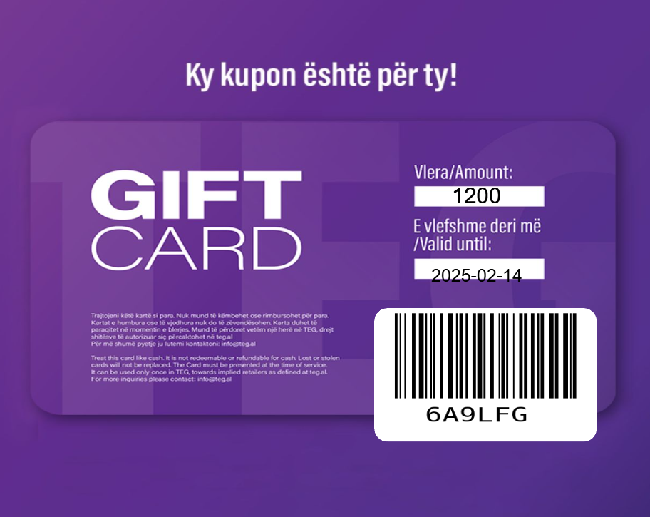

# Balfin Coupon Generator

## Project Overview
This Django-based application is designed to manage coupons or vouchers efficiently. With this system, you can:

- **Generate Coupons**: Create new coupons with unique codes and properties.
- **Search Coupons**: Look up coupons by their code or other attributes.
- **Validate Coupons**: Mark coupons as valid or invalid with a `True/False` status.
- **Send Coupons via Email**: Send coupon codes directly to users' emails for easy access.
- **Dashboard Management**: View and manage all coupons from a user-friendly dashboard.
- **Barcode Support**: Each coupon can include a barcode (e.g., code `127`) for scanning and redemption.

## Key Features
1. **Coupon Generation**:
   - Automatically generates coupons with unique codes.
   - Assigns properties such as validity, usage status, and expiration date.

2. **Search Functionality**:
   - Search for coupons by code, status, or other fields.
   - Quickly locate specific vouchers from the database.

3. **Validation**:
   - Validate coupons with a `True/False` status to ensure proper usage.
   - Mark coupons as used or active.

4. **Email Integration**:
   - Send coupons directly to users via email.
   - Include the coupon code, expiration date, and barcode (e.g., code `127`).

5. **Dashboard**:
   - Access a user-friendly dashboard to view, edit, or delete coupons.
   - Manage coupon statuses and resend email notifications.

6. **Barcode Support**:
   - Each coupon can be associated with a barcode for easy scanning.
   - Barcodes (e.g., `127`) can represent the coupon's unique ID or value.

## How to Use
1. **Generate a Coupon**:
   - Navigate to the coupon creation form on the dashboard.
   - Fill in details such as code, expiration date, and status.

2. **Search Coupons**:
   - Use the search bar in the dashboard to look for coupons by code or other attributes.

3. **Validate Coupons**:
   - Mark a coupon as valid or invalid using the toggle in the dashboard.

4. **Send Coupons via Email**:
   - Select a coupon from the dashboard and choose the "Send via Email" option.
   - Enter the recipient's email address and send the coupon with barcode `127`.

5. **View Dashboard**:
   - Access the dashboard to view all coupons, their statuses, and usage history.

## Dependencies
- Python 3.11+
- Django 4.x
- Django Rest Framework
- Pillow (for image and barcode handling)
- SMTP (for email functionality)

## Installation
1. Clone the repository:
   ```bash
   git clone https://github.com/yourusername/balfin-coupon-generator.git
   cd balfin-coupon-generator
   ```

2. Create a virtual environment:
   ```bash
   python -m venv endiENV
   source endiENV/bin/activate # (or .\endiENV\Scripts\activate on Windows)
   ```

3. Install dependencies:
   ```bash
   pip install -r requirements.txt
   ```

4. Run migrations:
   ```bash
   python manage.py migrate
   ```

5. Start the development server:
   ```bash
   python manage.py runserver
   ```

## Usage
- Open your browser and go to `http://127.0.0.1:8000/`.
- Log in as an admin or create a new account.
- Access the dashboard to manage coupons.

## Screenshots


## Future Enhancements
- Add SMS integration for sending coupons.
- Implement advanced analytics for coupon usage.
- Add support for exporting coupon data to CSV.

---

Feel free to reach out for further assistance or to contribute to this project!

